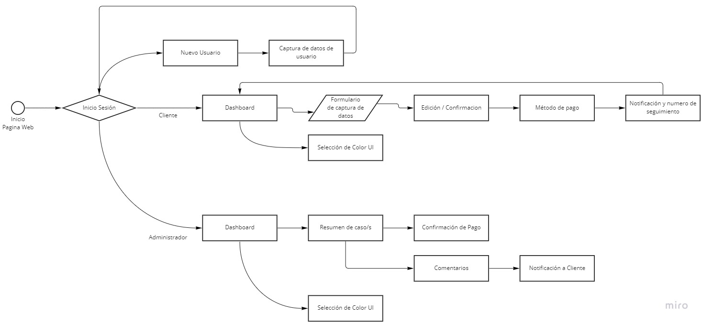
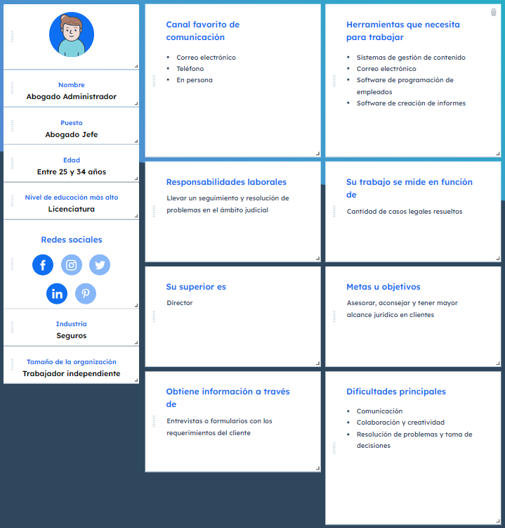
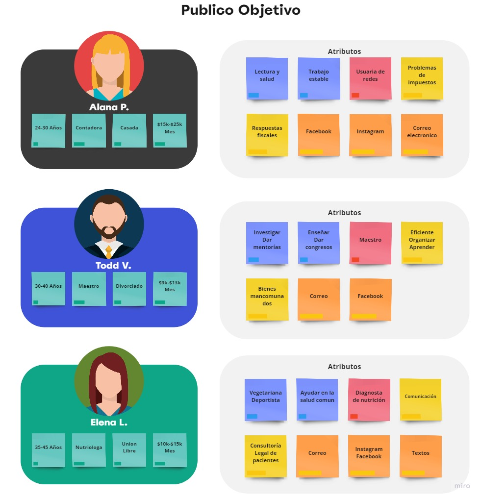
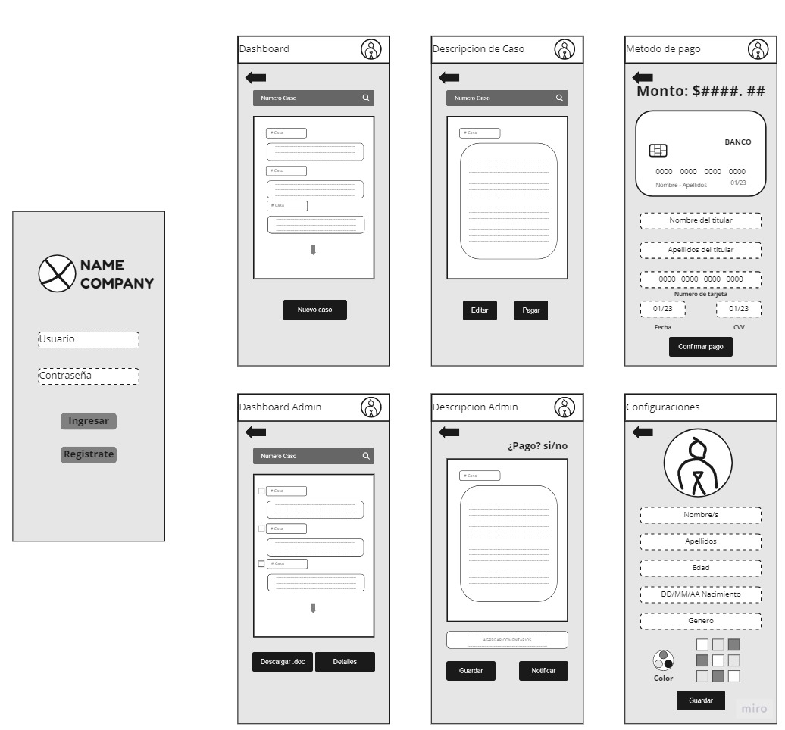

# ABOGABOT
## Descripcion de practica

Para la práctica se requiere de una página web que capture los datos de un cliente con un
formulario, que además se cree un inicio de sesión e imprima un numero de referencia para
dar seguimiento al caso del abogado y pago en aplicación. 

Por otro lado, se requiere también de una página para que el abogado pueda ver los casos
de los clientes almacenados, además de ver las confirmaciones de pago.

## **1. Toma de requerimientos**

La toma de requerimientos general para la página web de la practica Abogabot deberá contener
lo siguiente:

***UX de Cliente***
- Creación de cuenta cliente
- Formulario de captura de datos del caso 
- Método de pago 
- Numero de seguimiento de caso/s 
- Notificación de actualización de caso 
- Observar comentarios de abogado 
- Selección de color 
- Responsiva para celular

***UX de Abogado***
- Creación de cuenta de Administrador 
- Reporte de Casos llenado por formularios 
- Notificación de nueva demanda 
- Dashboard con datos y cumplimiento de pago 
- Agregar comentarios y actualización 
- Envió de notificaciones a cliente 
- Selección de color 
- Responsiva para celular

A continuacion muestro _diagrama de flujo_ propuesto para aplicacion:

## **1.1. Buyer Persona**

Se define el cliente ideal, el cual es representado por el abogado administrador

Para llevar a cabo esta practica, se usode apoyo la herramienta de buyer en https://www.hubspot.es/make-my-persona con los requerimientos del Abogabot 

## **2. Publico Objetivo**

Para el publico objetivo se define como los posibles compradores del servicio y las necesidades de las cuales partir para solucionar sus problemas

Se utiliza plantilla como referencia en https://miro.com/es/plantillas/publico-objetivo/

## **3. Primer Wireframe**

A continuacion se muestra el borrador wireframe del proyecto Abogabot con los requerimientos de la practica.

Se utiliza la plataforma miro a modo de odelado http://mio.com/es/

## **4. UI Abogabot**

Como ultimo punto de la practica, se realiza un diseño de UI en Figma para la presentacion Frontend, el cual mostrara los requerimientos mencionados
y desarrollados en el proyecto a continuacion:
